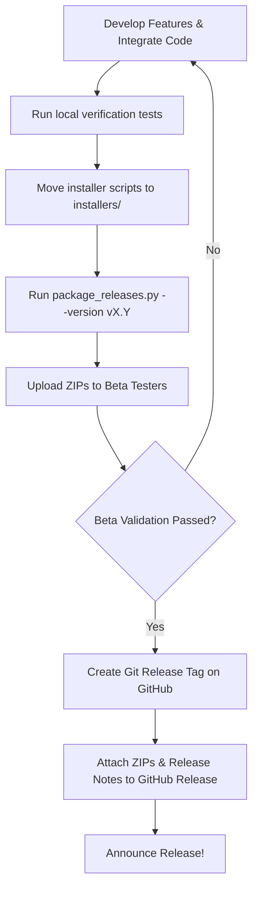

# SUDARSHAN AI — Release Checklist & Deployment Workflow
*Maintaining the highest standard of cross-platform software delivery.*

This document provides a systematic workflow for testing, packaging, and deploying new releases of SUDARSHAN AI.

---

## 📈 Release Versioning Strategy

SUDARSHAN AI uses Semantic Versioning (`vMAJOR.MINOR.PATCH`):
* **MAJOR**: Architectural overhauls, major UI redesigns, or breaking API changes.
* **MINOR**: New explainability features, optimized model checkpoints, or performance improvements.
* **PATCH**: Safe bug fixes, security updates, or manual edits.

### Release Classification
1. **Development Builds (`dev`)**: Commits pushed to active feature branches. No release packaging.
2. **Beta Builds (`beta`)**: Release candidates bundled using `package_releases.py` and distributed to testers to verify hardware coverage (specifically Apple Silicon vs. Intel macOS, and CUDA configuration on Windows).
3. **Production Builds (`stable`)**: Validated, signed releases pushed to main branch and uploaded as official GitHub Releases.

---

## 📋 Release Checklist

Before running the automated build pipeline and rolling out any version to users, complete the following QA checklist:

### 1. Codebase Integrity
- [ ] Code compiles without syntax errors: `python3 -m py_compile src/*.py gui/*.py`
- [ ] UI imports resolve natively without dynamic runtime path overrides (`sys.path.insert`).
- [ ] All third-party package modifications (like translation/multi-lingual dropdown selectors) are fully integrated into [gui/sudarshn_ui.py](file:///Users/karmansinghtalwar/Documents/SUDARSHAN%20AI%20copy%202/gui/sudarshn_ui.py).

### 2. Weights & Model Checks
- [ ] Model weights file [models/best_vit_model.pth](file:///Users/karmansinghtalwar/Documents/SUDARSHAN%20AI%20copy%202/models/best_vit_model.pth) is present and has exactly `18031705` bytes.
- [ ] Baseline compilation test passes: `python3 verify_timm.py` outputs `Success!` without exceptions.

### 3. Installer Script Validation
- [ ] Windows installers are housed in [installers/windows/](file:///Users/karmansinghtalwar/Documents/SUDARSHAN%20AI%20copy%202/installers/windows/) and contain logging redirects.
- [ ] macOS installers are housed in [installers/macos/](file:///Users/karmansinghtalwar/Documents/SUDARSHAN%20AI%20copy%202/installers/macos/) and contain logging redirects.
- [ ] Linux installers are housed in [installers/linux/](file:///Users/karmansinghtalwar/Documents/SUDARSHAN%20AI%20copy%202/installers/linux/) and contain logging redirects.

### 4. Build Pipeline Execution
- [ ] Automated build script [package_releases.py](file:///Users/karmansinghtalwar/Documents/SUDARSHAN%20AI%20copy%202/package_releases.py) is present in root and marked executable.
- [ ] Staging and zipping runs cleanly without folder lock errors: `python3 package_releases.py --version v1.0`
- [ ] Versioned zip artifacts and SHA-256 checksums are successfully generated in `releases/`.

---

## 🚀 Deployment Workflow

### Steps:
1. **Verification**: Execute `verify_timm.py` to confirm F-Net compiles and weights load correctly.
2. **Build**: Run the packaging script `python3 package_releases.py --version v1.0`.
3. **Verification of ZIPs**: Ensure `SUDARSHAN_AI_Windows_v1.0.zip`, `SUDARSHAN_AI_Mac_v1.0.zip`, and `SUDARSHAN_AI_Linux_v1.0.zip` contain their respective installers/launchers at the root of their extracted directories.
4. **Publishing**: Upload the verified ZIP files and copy the auto-generated contents of `releases/RELEASE_NOTES_v1.0.md` into the GitHub Releases editor.
